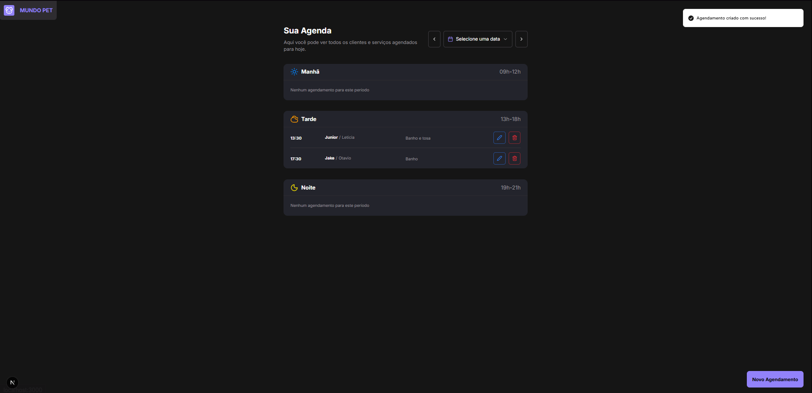
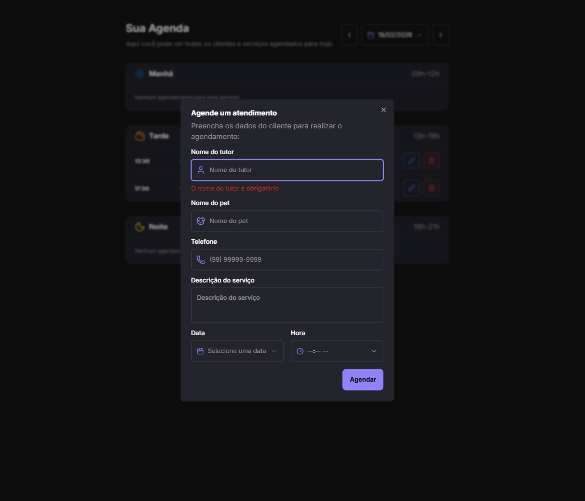

# Sistema de Agendamento - Petshop

Sistema de gestão de agendamentos para petshop desenvolvido com Next.js 15, implementando arquitetura moderna baseada em Server Components e Server Actions. O projeto prioriza type-safety, separação de responsabilidades e experiência de desenvolvimento através de ferramentas de qualidade de código automatizadas.

A solução gerencia o ciclo completo de agendamentos com validação de regras de negócio (períodos permitidos, conflitos de horário), interface responsiva otimizada para mobile-first e revalidação inteligente de cache para garantir consistência de dados.

## Preview

## Principais Responsabilidades

- Gestão completa de agendamentos (CRUD) com validação de períodos permitidos (manhã: 9h-12h, tarde: 13h-18h, noite: 19h-21h)
- Prevenção de conflitos de horário através de validação server-side
- Agrupamento automático de agendamentos por período do dia
- Interface responsiva com design system customizado
- Filtragem de agendamentos por data com suporte a navegação temporal

## Arquitetura

O projeto segue uma arquitetura modular baseada no App Router do Next.js 15, com separação clara entre camadas:

- **Presentation Layer** (`src/app/`, `src/components/`): Server Components para renderização inicial e Client Components para interatividade, seguindo o padrão de colocation
- **Application Layer** (`src/app/actions.ts`): Server Actions com validação Zod e tratamento de erros tipado
- **Domain Layer** (`src/utils/`, `src/types/`): Lógica de negócio isolada (agrupamento por período, cálculo de períodos) e tipos de domínio
- **Infrastructure Layer** (`src/lib/prisma.ts`): Abstração do Prisma Client com configuração centralizada
- **Shared Layer** (`src/lib/utils.ts`): Utilitários compartilhados (cn helper para Tailwind)

A estrutura utiliza path aliases (`@/*`) para imports absolutos, facilitando refatoração e navegação no código.

## Decisões Técnicas Importantes

**Prisma Client com Output Customizado**: O Prisma Client é gerado em `src/generated/prisma` ao invés do padrão `node_modules`, permitindo melhor controle de versionamento e imports tipados através do path alias.

**Server Actions com Validação Zod**: Todas as mutations utilizam Server Actions com validação Zod server-side, eliminando necessidade de API routes e garantindo type-safety end-to-end. O schema de validação é compartilhado entre client e server.

**Revalidação Seletiva de Cache**: Utilização de `revalidatePath('/')` após mutations para invalidar apenas a rota afetada, otimizando performance sem necessidade de revalidação global.

**Separação Server/Client Components**: Aplicação consistente do padrão onde Server Components são default e Client Components são explicitamente marcados com `'use client'`, minimizando JavaScript no bundle inicial.

**Design System com Tailwind CSS 4**: Sistema de design customizado utilizando CSS variables no `@theme` do Tailwind 4, permitindo theming centralizado e manutenção facilitada de tokens de design.

**Git Hooks Automatizados com Lefthook**: Pre-commit para formatação automática e pre-push para type-check, garantindo qualidade de código antes do push sem overhead manual.

## Segurança Implementada

**Server Actions Nativo**: Proteção automática contra CSRF através do mecanismo nativo do Next.js 15 para Server Actions.

**Validação Server-Side Obrigatória**: Todas as operações de escrita validam dados com Zod no servidor, impedindo bypass de validações client-side.

**Type Safety End-to-End**: TypeScript strict mode combinado com tipos inferidos do Prisma e Zod, eliminando classes de erros em runtime.

**Validação de Regras de Negócio**: Verificação server-side de períodos permitidos e conflitos de horário antes de persistência, garantindo integridade dos dados.

## Padrões Utilizados

**Server Components First**: Priorização de Server Components para renderização inicial, utilizando Client Components apenas quando necessário (formulários, interatividade).

**Component Composition**: Padrão de composição através de props children e compound components (Dialog, AlertDialog), facilitando reutilização e manutenção.

**Form Validation Pattern**: Integração react-hook-form + zod + zodResolver para validação sincronizada entre client e server, com feedback visual imediato.

**Error Handling Pattern**: Server Actions retornam objetos `{ error?: string }` para tratamento consistente de erros no client, com toast notifications via Sonner.

**Utility-First CSS**: Abordagem utility-first com Tailwind, mas com design tokens centralizados via CSS variables para facilitar manutenção e theming futuro.

## Diferenciais Técnicos do Projeto

- **Next.js 15 + React 19**: Utilização das versões mais recentes com suporte a Server Components, Server Actions e otimizações de renderização
- **Prisma com Output Customizado**: Configuração avançada do Prisma para melhor controle de tipos e imports
- **Type-Safe Forms**: Validação sincronizada client/server com tipos inferidos automaticamente
- **Design System Escalável**: Sistema de design baseado em tokens CSS com Tailwind 4, preparado para evolução
- **Developer Experience**: Git hooks automatizados, path aliases, e estrutura de pastas que facilita navegação e manutenção
- **Otimizações de Performance**: Revalidação seletiva de cache, Server Components para reduzir bundle size, e queries otimizadas com Prisma
- **Regras de Negócio Centralizadas**: Lógica de períodos e validações isoladas em utils, facilitando testes e manutenção
.
## Tecnologias Utilizadas

- Next.js 15.4.6
- React 19.1.0
- TypeScript 5
- Prisma 6.14.0
- PostgreSQL 17
- Tailwind CSS 4
- Zod 4.1.0
- React Hook Form 7.62.0
- Radix UI
- date-fns 4.1.0
- Sonner
- Lefthook
- Docker Compose
- ESLint + Prettier

## Possíveis Evoluções Arquiteturais

**Autenticação e Autorização**: Implementação de NextAuth.js ou similar para autenticação, com middleware de autorização e proteção de rotas. Adição de roles e permissões granulares.

**Multi-tenancy**: Suporte a múltiplos petshops através de tenant isolation no Prisma, com filtros automáticos baseados em contexto de usuário.

**Event-Driven Architecture**: Migração de operações síncronas para eventos assíncronos (ex: notificações de agendamento, lembretes) utilizando filas (Bull/BullMQ) ou message brokers.

**CQRS Pattern**: Separação de comandos (mutations) e queries, com otimização específica para cada caso de uso e possibilidade de read models otimizados.

**Domain-Driven Design**: Evolução para DDD completo com agregados, value objects e domain events, isolando ainda mais a lógica de negócio da infraestrutura.

**Testes Automatizados**: Implementação de testes unitários (Vitest), testes de integração para Server Actions e testes E2E (Playwright) para fluxos críticos.

**Observabilidade**: Adição de logging estruturado, métricas de performance e error tracking (Sentry) para monitoramento em produção.

**Cache Strategy Avançada**: Implementação de cache distribuído (Redis) para queries frequentes e invalidação inteligente baseada em eventos.

**API Externa**: Expansão para API REST/GraphQL externa caso necessário para integrações, mantendo Server Actions para uso interno.
